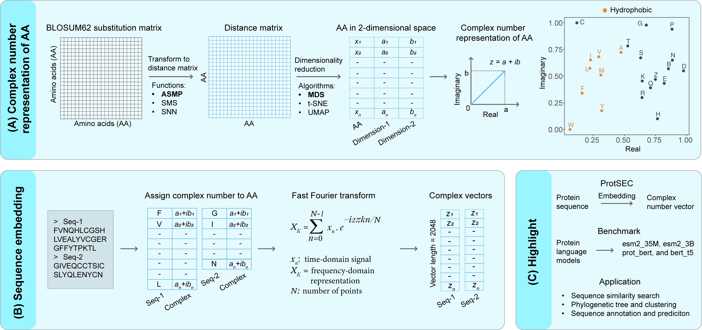

## ProtSEC architecture for protein seqence embedding
**ProtSEC** (**Prot**ein **S**equence **E**mbedding in **C**omplex Space) is an ultrafast method for embedding protein sequences using the discrete Fourier transform. Unlike large protein language models (PLMs), ProtSEC requires no training on sequence data. It is 20,000× faster and uses 85× less memory compared to the popular models like ESM2-35M, ESM2-3B, ProtBERT, and BERT-T5. ProtSEC is lightweight enough to run on personal or laptop computers, even for processing large protein sequence datasets. 

<p align="center">
  
</p>

### 1. Requirement

 - Python >= 3.10
 - Linux
 - macOS >= 13.5

### 2. Installation

 - Clone the repository and navigate to the project directory

```sh
git clone https://github.com/Rajan-sust/ProtSEC
cd ProtSEC/
```

- Create a virtual environment and activate

```
python3 -m venv venv
source venv/bin/activate
```

- Upgrade `pip` and install the required dependencies

```
pip install --upgrade pip
pip install -r requirements.txt
```

### 3. Run ProtSEC

- Generate complex embedding using a FASTA file

```
# Available dimensionality reduction methods: `MDS`, `t-SNE`, `UMAP`
# Dist functions: `SMS`, `ASMP`, `SNN`

python3 db_build.py \
    --fasta_path ./data/DB.fasta \
    --dim_reduct MDS \
    --dist_func SMS \
    --db_dir_path ./DB \
    --db_filename mds_sms_db.pkl
```

- Protein sequence similarity search

Output `result.tsv` contains score in the 3rd column which is correlation value between query and hit.

```
python3 annotate.py --input_faa ./data/QUERY.fasta \
    --db ./DB/mds_sms_db.pkl \
    --dim_reduct MDS \
    --dist_func SMS \
    --top_hit 1 \
    --out ./data/result.tsv
```

- Generate phase correlation matrix using ProtSEC

`-n` : Dimension of the embedding. If you're working with a multi-FASTA file containing sequences of varying lengths, use the 75th percentile of sequence lengths. Otherwise, use the actual sequence length. Default is 512.

```
python3 gen-ph-cor.py -n 512 -i phosphatase.fa -o score_matrix.csv
```

### 4. Benchmark 

- Benchmarking used in the manuscript

```
bash ./benchmark/benchmark.sh
```

- PLM Embedding
Code to run 'esm2_small', 'esm2_large', 'prot_bert', 'prot_t5' is available [here](https://github.com/Rajan-sust/GeneAnnotation) 

### 5. Contact
Rashedul Islam, PhD (rashedul.gen@gmail.com)

### 6. Citation
Raju RS and Rashedul I. SigProt: Ultra-fast protein sequence embedding method using evolutionary conservation, (2025).

### 7. License
This project is licensed under the MIT license.
